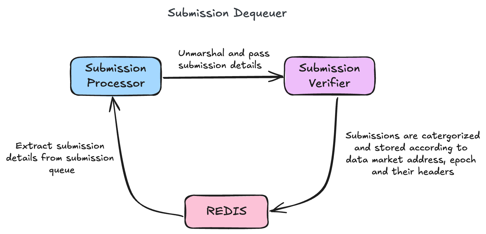

## Table of Contents
- [Table of Contents](#table-of-contents)
- [Overview](#overview)
- [Architecture](#architecture)
- [Find us](#find-us)

## Overview

The **Dequeuer** plays a pivotal role within the **Submission Sequencer** system, serving as the first step in the batch processing pipeline. It is responsible for dequeueing incoming snapshot submissions as accepted by the libp2p listener peer, verifiying and storing the submission data.

Key functionalities:

- **Etract Submissions:** Dequeue incoming snapshot submission details from the Submission Queue, which acts as a buffer for incoming data and process the dequeued details to ensure they are in a suitable format for further operations.
- **Verify Submissions:** Perform validation checks on the snapshot submission details to ensure their authenticity and integrity.
- **Store Submissions:** After verification, the processed data is securely stored in Redis, organized based on their respective submission headers for efficient categorization and retrieval.

## Architecture

The Dequeuer is structured around three primary modules that collectively enable its functionality:

1. **Main Module(`cmd/main.go`)**:
   - This serves as the entry point for the Dequeuer component, orchestrating key operations such as initializing interfaces, retrieving and processing snapshot submission details.

2. **Configuration Module (`/config`)**:
   - The `/config` directory houses configuration files that define critical system parameters. These include client urls, contract addresses, timeout settings, security parameters, and other project-specific configurations.

3. **Package Module (`/pkgs`)**:
   - The core event processing logic resides in the `/pkgs/dequeuer` directory. These modules manage snapshot submission details retrieval, verifying and storing the snapshot submission details, forming the foundation of the Dequeuer's operations.

This modular design ensures a well-defined separation of responsibilities, with each module focusing exclusively on a distinct aspect of the system's functionality. By organizing the system into clearly delineated modules, each component can operate independently while contributing to the overall system architecture.

## Find us

* [Discord](https://powerloom.io/discord)
* [Twitter](https://twitter.com/PowerLoomHQ)
* [Github](https://github.com/PowerLoom)
* [Careers](https://wellfound.com/company/powerloom/jobs)
* [Blog](https://blog.powerloom.io/)
* [Medium Engineering Blog](https://medium.com/powerloom)
